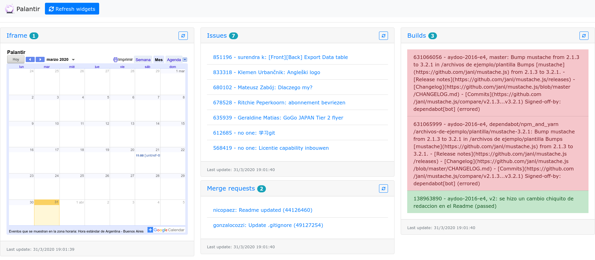

<p align="center">
<!-- PROJECT LOGO -->

<br />
  <h2 align="center">Palantir project - Web UI</h2>

  <p align="center">
    The web UI of the Palantir Information Radiator Project
    <br />
    <a href="https://gitlab.com/untref-ingsoft/tfi-cozzi/information-radiator/-/wikis/home"><strong>Explore the docs »</strong></a>
    <br />
    <br />
    <a href="http://ec2-18-230-21-194.sa-east-1.compute.amazonaws.com:8080/">View Demo</a>
    ·
    <a href="https://gitlab.com/untref-ingsoft/tfi-cozzi/information-radiator/issues">Report Bug</a>
    ·
    <a href="https://gitlab.com/untref-ingsoft/tfi-cozzi/information-radiator/issues">Request Feature</a>
  </p>
</p>

<!-- TABLE OF CONTENTS -->

## Table of Contents

- [About the Project](#about-the-project)
  - [Built With](#built-with)
  - [Getting Started](#getting-started)
  - [Prerequisites](#prerequisites)
  - [Installation](#installation)
  - [Installation (with the Palantir web API project)](#installation-with-the-palantir-web-api-project)
- [Usage](#usage)
- [Roadmap](#roadmap)
- [Contributing](#contributing)
- [License](#license)
- [Contact](#contact)
- [Additional bibliography and acknowledgements](#additional-bibliography-and-acknowledgements)

<!-- ABOUT THE PROJECT -->

## About The Project

Web frontend built with HTML, JavaScript and CSS for the Palantir Information Radiator project. Main objective: to show on computers and Samsung Smart TVs, which run Tizen OS, information obtained from the [Palantir Web API](https://gitlab.com/untref-ingsoft/tfi-cozzi/information-radiator).

### Built With

- [Bootstrap](https://getbootstrap.com)
- [JQuery](https://jquery.com)
- [Tizen Studio and Tizen SDK](https://developer.tizen.org/development)

<!-- GETTING STARTED -->

## Getting Started

To get a local copy up and running consider these recommendations and follow these simple example steps:

### Prerequisites

This project was designed to work in conjunction with the [Palantir Web API project](https://gitlab.com/untref-ingsoft/tfi-cozzi/information-radiator). Please read the [installation instructions on its README](https://gitlab.com/untref-ingsoft/tfi-cozzi/information-radiator#installation-with-the-palantir-web-ui).

However, if you are interested in developing this project, you can clone this repo with git:

```sh
git clone https://gitlab.com/untref-ingsoft/tfi-cozzi/palantir-tizen-ui.git
```

Additionally, you can run this website on a web server such as [Apache](https://httpd.apache.org/) or [nginx](https://nginx.org/en/download.html).

### Installation

If you are not interested in developing this project or using it in conjunction with the [Palantir Web API project](https://gitlab.com/untref-ingsoft/tfi-cozzi/information-radiator), you can download it from Docker Hub with the following command:

- For AMD64 (x86-64) Docker installations:

```sh
docker pull gonzalocozzi/palantir-web-amd64
```

- For ARM64 (aarch64) Docker installations:

```sh
docker pull gonzalocozzi/palantir-web-arm64
```

...and run the Docker container with:

- For AMD64 (x86-64) Docker installations (with port 8080 exposed):

```sh
docker run -d -p 8080:80 gonzalocozzi/palantir-web-amd64
```

- For ARM64 (aarch64) Docker installations (with port 8080 exposed):

```sh
docker run -d -p 8080:80 gonzalocozzi/palantir-web-arm64
```

You can also generate the Docker image locally, after cloning the repository, from the Dockerfile available in the project:

```sh
docker build -t docker-image-name path-to-dockerfile
```

### Installation (with the Palantir web API project)

You can use this project in conjunction with the [Palantir Web API project](https://gitlab.com/untref-ingsoft/tfi-cozzi/information-radiator), using Docker Compose. This requires three files **which must be located in the same folder**:

- a configuration file for this API, called _apiConfig.json_ (example [at this link](https://gitlab.com/untref-ingsoft/tfi-cozzi/information-radiator/-/blob/master/deploy/apiConfig.json))

- a configuration file for the web frontend called _webConfig.json_ (example [at this link](https://gitlab.com/untref-ingsoft/tfi-cozzi/palantir-tizen-ui/-/blob/master/deploy/webConfig.json))

- a Docker Compose file (example [at this link](https://gitlab.com/untref-ingsoft/tfi-cozzi/palantir-tizen-ui/-/blob/master/deploy/docker-compose.yml)).

To run the Docker Compose and start the application, the following command must be run in the folder in which the three files are stored:

```sh
docker-compose up -d
```

<!-- USAGE EXAMPLES -->

## Usage

If you followed the previous instructions, you should be able to see the web frontend running in any web browser by opening the address http://localhost:8080. If this is the case, you will see a screen similar to this one:



<!-- ROADMAP -->

## Roadmap

See the [open issues](https://gitlab.com/untref-ingsoft/tfi-cozzi/information-radiator/issues) for a list of proposed features (and known issues).

<!-- CONTRIBUTING -->

## Contributing

Please read [CONTRIBUTING](https://gitlab.com/untref-ingsoft/tfi-cozzi/palantir-tizen-ui/-/blob/master/CONTRIBUTING.md) for details on our code of conduct, and the process for submitting pull requests to us.

<!-- LICENSE -->

## License

Distributed under the GPL License. See [LICENSE](https://gitlab.com/untref-ingsoft/tfi-cozzi/palantir-tizen-ui/-/blob/master/LICENSE) for more information.

<!-- CONTACT -->

## Contact

Gonzalo Alejandro Cozzi - gcozzi@untref.edu.ar

<!-- ACKNOWLEDGEMENTS -->

## Additional bibliography and acknowledgements

- [Scrum Patterns](http://scrumbook.org/value-stream/information-radiator.html)
- [Agile Software Development: Forming Teams that Communicate and Cooperate](http://www.informit.com/articles/article.aspx?p=24486)
- [Information radiator](http://josehuerta.es/gestion/agile/information-radiators/information-radiator)
- [Create Your First Samsung Smart TV Web Application](https://developer.tizen.org/ko/development/get-started/web-applications/create-samsung-smart-tv-web-application?langredirect=1)
- [Deploying NGINX and NGINX Plus with Docker](https://www.nginx.com/blog/deploying-nginx-nginx-plus-docker/)
- [Tips for Deploying NGINX (Official Image) with Docker](https://www.docker.com/blog/tips-for-deploying-nginx-official-image-with-docker/)
- [Build and run your Docker image](https://docs.docker.com/get-started/part2/)
- [Share images on Docker Hub](https://docs.docker.com/get-started/part3/)
- [Overview of Docker Compose](https://docs.docker.com/compose/)
- [Choose an Open Source License](https://choosealicense.com)
